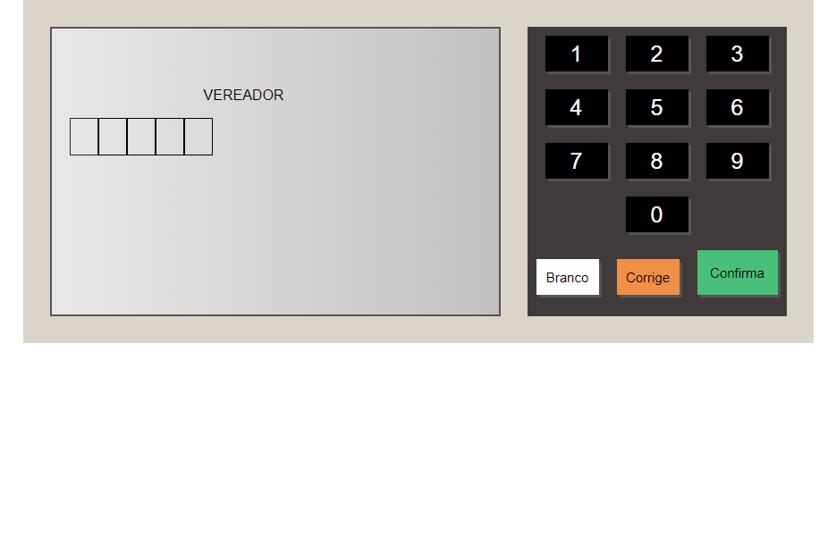

# Urna eletrônica
> site para estudo de javaScript

Projeto construído como exercício do curso da B7web
> finalizado 

[Clique aqui para acessar](https://rafael-damasceno.github.io/Urna-eletronica/)

## Tecnologias:

- HTML
- CSS
- Git e Github
- JavaScript
